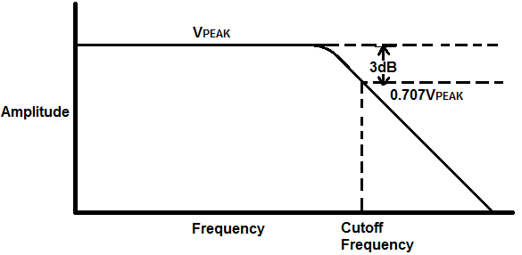
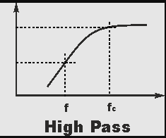
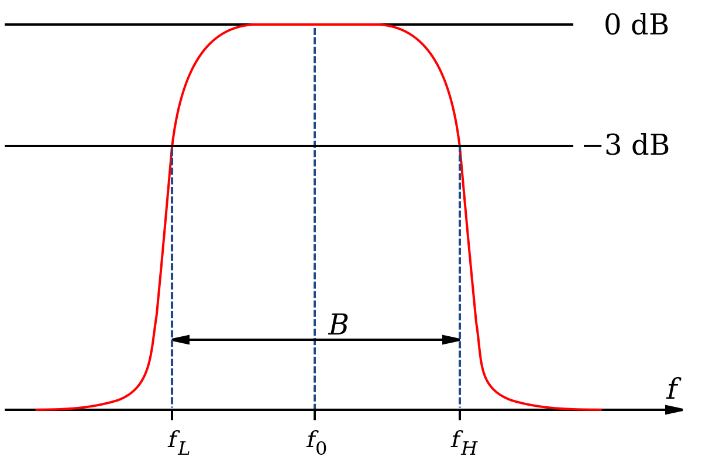
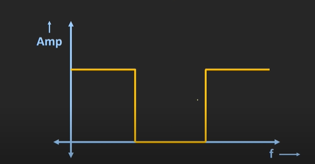

# Signal Denoised Filter - Matlab
 
 
 ### What is filter? 
 We work on signal processing,so in signal processing, a filter is a mechanism that eliminates any unnecessary components or features from the signal.
 
Filtering is a class of signal processing, the filter concept being the total or partial suppression of any component of the signal. 
Almost all of the time, this involves eliminating certain frequency or frequency bands. However, filters do not work solely in the frequency domain; several other filtering objectives occur particularly in image processing.

#### Types of Filter
1. Non Linear or Linear
2. Time Variant or Time invariant
3. Casual or Non Casual
4. Analog or Digital
5. Discrete Time or Continuous Time
6. Passive or active type of continuous time filter
7. Infinite impulse respone or Finnite impulse response type of discrete time or digital Filter

**Based** On the range of frequencies which is being passed by the filter, there're four different types of filter:

1. **Low Pass Filter**
	
	Low pass filter is the electric circuit, which passes the low range of frequency signals, starting from 0Hz to up to the cut off frequency (fc), and rejects all the other frequencies which are higher than cut off frequency (threshold frequency).  
	
	
2. **High Pass Filter**
	
	High pass filter passes all the high frequency components starting from the cut off frequency(fc) and it rejects all the frequencies which are lesser than this cut off frequency. 
	
	
	
3. **Band Pass Filter**
	
	Band pass filter passes the frequencies which are in the certain band and rejects all the frequencies which are outside this band. 
	
	
	
4. **Band Reject Filter**

	Band reject filter, rejects all the frequency components which are under certain band and it pass all the frequencies out of this particular band. 
	
	
 
 **Low Pass Filter**  classified into two diffrent types: 
 1. **Active LPF**
 
 	If the low filter is designed using the active components like Op-Amp and transistors then such filters are known as active low pass filter.
	
 
 2. **Passive LPF**
 
 	If the low pass filter is designed using the passive components like R, L and C then such filters are known as passive low pass filters.

**Most** common types of Passive Low Pass Filters:
1. RC Low Pass Filter
2. RL Low Pass Filter
3. RLC Low Pass Filter

 
##### Linear Continuous Time Filters
This filter is intended to eliminate certain frequencies and allow the passage of others. It's also known as newtwork syntesis.

Some significant filter families that are constructed in this manner are:

1. Chebyshev filter

